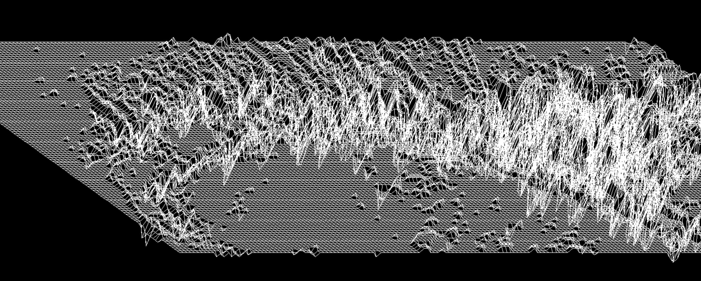
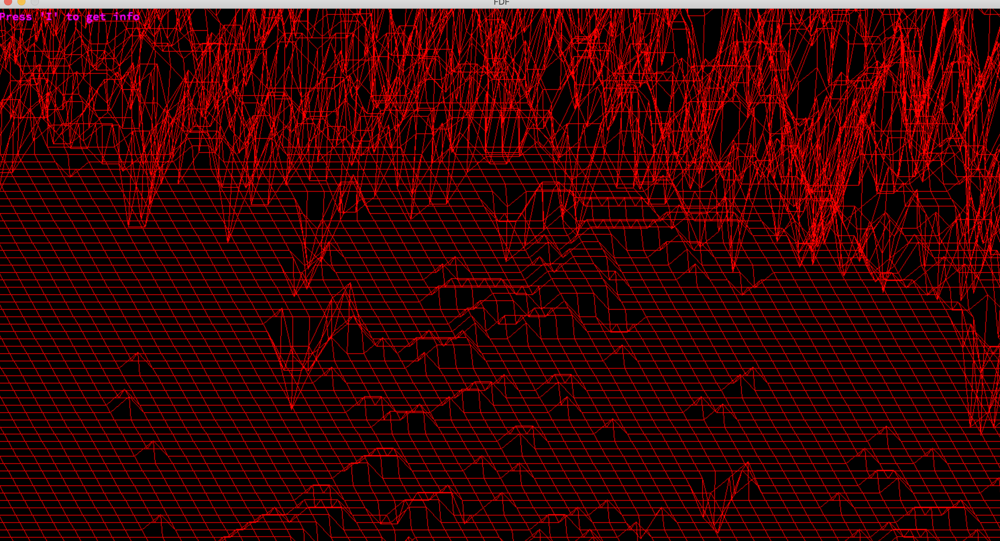

# FDF # 42 # Unit Factory
This project is about creating a simplified graphic “wireframe” (“fils de fer” in french, hence the name of the project) representation of a relief landscape linking various points (x, y, z) via segments. The coordinates of this landscape are stored in a file passed as a parameter to your program. If you want more details - check the attached pdf.

# Running
For correct work program & project need install [MLX library](https://github.com/abouvier/minilibx).
```
make
./fdf file
```

Example:
```
./fdf maps/mars.fdf
```

# Map
Each number corresponds to a point in space:

1. The horizontal position corresponds to its axis.
2. The vertical position corresponds to its ordinate.
3. The value corresponds to its altitude.

You can set the color of point:
```
4 4 4,0xfefefe
4 4 4
4 4 4
```

# Some Examples




